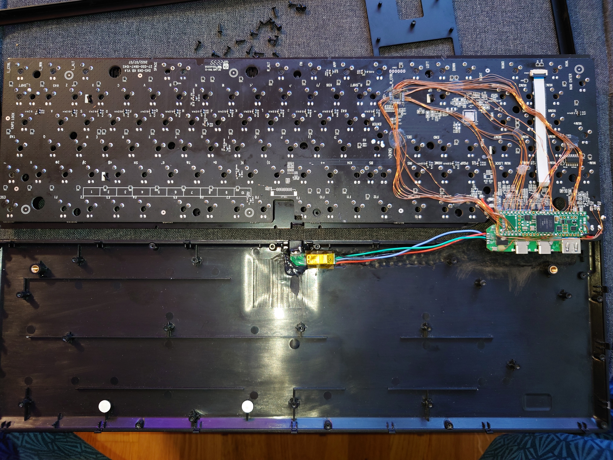
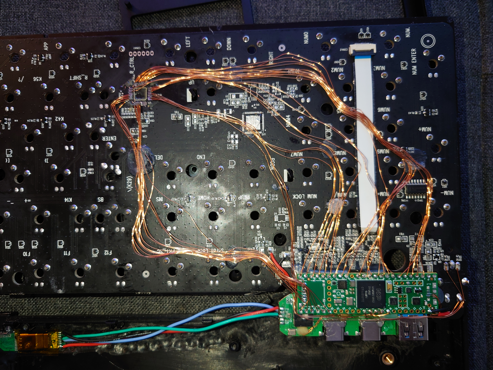

# daskeyboard6pro

Custom handwired modded DasKeyboard 6 Pro for Teensy 3.5 (daskeyboard6pro_avr, abandoned) and Teensy 4.1 (daskeyboard6pro_nxp) with custom 1x6 hardware PWM LED matrix backlight driver.

I also replaced the built-in USB hub with my own (but gave up on USB 3 connectivity because it was too much of PITA) and did some questionable plastic surgery on the keyboard PCB and case...

[DasKeyboard6 Reverse engineering Notes](DasKeyboard6_RE-Notes.pdf)

*A short description of the keyboard/project*

* Keyboard Maintainer: [Gabriel](https://github.com/gpregger)
* Hardware Supported: Teensy 4.1
* Hardware Availability: [PJRC Store](https://www.pjrc.com/store/teensy41.html)

Make example for this keyboard (after setting up your build environment):

    qmk compile -c -kb daskeyboard6pro_nxp -km default

Flashing example for this keyboard:

    qmk flash -m TEENSY41 .build/daskeyboard6pro_nxp_default.hex

See the [build environment setup](https://docs.qmk.fm/#/getting_started_build_tools) and the [make instructions](https://docs.qmk.fm/#/getting_started_make_guide) for more information. Brand new to QMK? Start with our [Complete Newbs Guide](https://docs.qmk.fm/#/newbs).

## Bootloader

Enter the bootloader in 3 ways:

* **Bootmagic reset**: Hold down the key at (0,0) in the matrix (Escape) and plug in the keyboard
* **Physical reset button**: Briefly press the button on the back of the PCB - some may have pads you must short instead
* **Keycode in layout**: Press the key mapped to `QK_BOOT` if it is available

